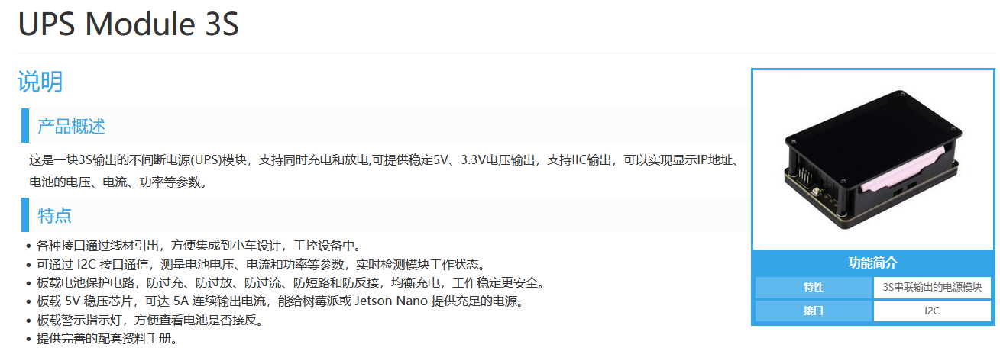
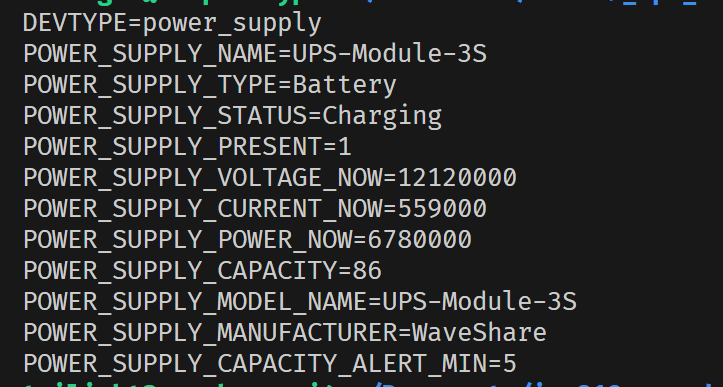
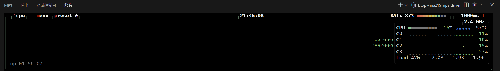

# Waveshare UPS Module 3S Linux Driver

Linux内核驱动程序，支持Waveshare UPS Module 3S在树莓派5上的电池监控功能。

> 部分代码由 Github Copilot 生成，本软件不提供任何保证，使用风险自负。

> 欢迎提出issue或者PR。

## 硬件支持

- **设备**: Waveshare UPS Module 3S (基于INA219电流/电压监控芯片) [技术文档](https://www.waveshare.net/wiki/UPS_Module_3S#.E6.96.87.E6.A1.A3)
  - 
- **平台**: 树莓派5 (Raspberry Pi 5)
- **接口**: I2C (地址: 0x41)
- **电池**: 3节18650锂电池串联

## 功能特性

- ✅ 实时电压监控
- ✅ 实时电流监控
- ✅ 功率计算
- ✅ 电池容量估算 (基于电压)
- ✅ 充放电状态检测
- 运行效果：
  - 
  - 

## 文件结构

```
ina219_ups_driver/
├── rpi-ups.c              # 主驱动源代码
├── rpi-ups-pi5.dts        # 设备树叠加文件
├── dkms.conf              # DKMS配置文件
├── Makefile               # 编译配置
├── monitor.sh             # 实时监控脚本
├── test_driver.sh         # 驱动功能测试脚本
└── README.md  
```

## 安装步骤

### 1. 系统准备

确保系统已安装必要的开发工具：

```bash
sudo apt update
sudo apt install -y dkms build-essential raspberrypi-kernel-headers
```

### 2. 启用I2C

编辑 `/boot/firmware/config.txt`，确保包含：

```ini
dtparam=i2c_arm=on
```

重启系统使I2C生效：

```bash
sudo reboot
```

### 3. 验证硬件连接

重启后检查I2C设备：

```bash
sudo i2cdetect -y 1
```

应该能看到地址0x41的设备：

```
     0  1  2  3  4  5  6  7  8  9  a  b  c  d  e  f
00:          -- -- -- -- -- -- -- -- -- -- -- -- -- 
10: -- -- -- -- -- -- -- -- -- -- -- -- -- -- -- -- 
20: -- -- -- -- -- -- -- -- -- -- -- -- -- -- -- -- 
30: -- -- -- -- -- -- -- -- -- -- -- -- -- -- -- -- 
40: -- 41 -- -- -- -- -- -- -- -- -- -- -- -- -- -- 
50: -- -- -- -- -- -- -- -- -- -- -- -- -- -- -- -- 
60: -- -- -- -- -- -- -- -- -- -- -- -- -- -- -- -- 
70: -- -- -- -- -- -- -- --
```

### 4. 编译驱动

进入源代码目录并编译：

```bash
cd /path/to/ina219_ups_driver
make clean
make
```

### 5. 安装设备树叠加

复制设备树文件到系统目录：

```bash
sudo cp rpi-ups-pi5.dts /boot/firmware/
sudo dtc -I dts -O dtb -o /boot/firmware/overlays/rpi-ups-pi5.dtbo /boot/firmware/rpi-ups-pi5.dts
```

编辑 `/boot/firmware/config.txt`，添加叠加：

```ini
dtoverlay=rpi-ups-pi5
```

### 6. DKMS安装 (推荐)

将源代码复制到DKMS目录：

```bash
sudo cp -r . /usr/src/rpi-ups-0.4/
```

添加、构建并安装DKMS模块：

```bash
sudo dkms add -m rpi-ups -v 0.4
sudo dkms build -m rpi-ups -v 0.4
sudo dkms install -m rpi-ups -v 0.4
```

### 7. 手动安装 (替代方案)

如果不使用DKMS，可以手动安装：

```bash
sudo cp rpi-ups.ko /lib/modules/$(uname -r)/kernel/drivers/power/supply/
sudo depmod -a
```

配置模块自动加载：

```bash
echo "rpi_ups" | sudo tee -a /etc/modules
```

### 8. 重启系统

重启使所有配置生效：

```bash
sudo reboot
```

## 使用方法

### 检查驱动状态

```bash
# 检查模块是否加载
lsmod | grep rpi_ups

# 检查设备是否识别
ls /sys/class/power_supply/UPS-Module-3S/

# 运行完整测试
./test_driver.sh
```

### 查看电池信息

```bash
# 查看所有电池属性
cat /sys/class/power_supply/UPS-Module-3S/uevent

# 查看具体属性
cat /sys/class/power_supply/UPS-Module-3S/voltage_now    # 电压 (μV)
cat /sys/class/power_supply/UPS-Module-3S/current_now    # 电流 (μA) 
cat /sys/class/power_supply/UPS-Module-3S/capacity       # 容量 (%)
cat /sys/class/power_supply/UPS-Module-3S/status         # 状态
```

### 实时监控

使用提供的监控脚本：

```bash
./monitor.sh
```

## 输出值说明

### 电池属性

- **voltage_now**: 当前电压 (微伏, μV)
- **current_now**: 当前电流 (微安, μA)
  - 正值表示充电
  - 负值表示放电
- **power_now**: 当前功率 (微瓦, μW)
- **capacity**: 电池容量百分比 (0-100%)
- **status**: 电池状态
  - `Charging`: 充电中 (电流 > 50mA)
  - `Discharging`: 放电中 (电流 < -50mA)
  - `Unknown`: 待机状态

### 容量计算 (存在数据不准确问题)

容量基于总电压线性计算：

- **满电**: 12.6V (4.2V × 3节)
- **低电**: 9.0V (3.0V × 3节)
- **公式**: `capacity = ((voltage - 9.0V) / (12.6V - 9.0V)) × 100%`

## 故障排除

### 1. 模块加载失败

```bash
# 检查内核日志
dmesg | grep UPS-Module

# 检查I2C通信
sudo i2cdetect -y 1

# 手动加载模块
sudo modprobe rpi_ups
```

### 2. 设备未识别

```bash
# 检查设备树叠加
cat /boot/firmware/config.txt | grep rpi-ups

# 检查I2C是否启用
cat /boot/firmware/config.txt | grep i2c_arm

# 重新编译设备树
sudo dtc -I dts -O dtb -o /boot/firmware/overlays/rpi-ups-pi5.dtbo rpi-ups-pi5.dts
```

### 3. 数值异常

```bash
# 检查寄存器配置
dmesg | grep "Configuration readback"
dmesg | grep "Calibration readback"

# 重新初始化
sudo rmmod rpi_ups && sudo modprobe rpi_ups
```

### 4. DKMS问题

```bash
# 查看DKMS状态
sudo dkms status

# 强制重新安装
sudo dkms remove rpi-ups/0.4 --all
sudo dkms install rpi-ups/0.4 --force
```

## 技术规格

### INA219配置

- **总线电压范围**: 32V (BRNG=1)
- **分流电压范围**: ±320mV (PG=3)
- **ADC分辨率**: 12位，32次采样
- **采样时间**: 17.02ms
- **工作模式**: 连续测量
- **校准值**: 4096 (0x1000)

## 更新日志

### v0.4 (当前版本)

- 修复I2C字节序问题
- 修正电流/电压计算公式
- 优化充放电检测逻辑
- 改进错误处理和调试输出
- 完善DKMS支持

### v0.3

- 初始DKMS支持
- 基本功能实现
